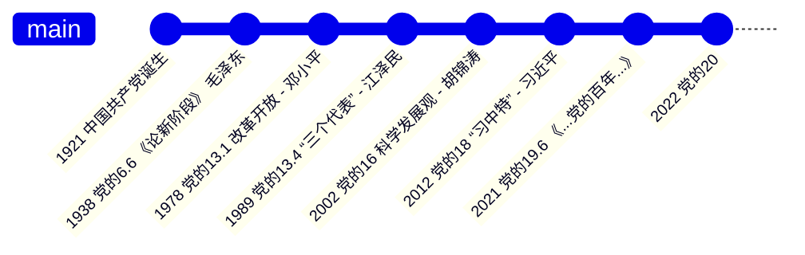

1. 新民主主义革命：浴血奋战，百折不挠
2. 社会主义革命和建设：自力更生，发愤图强
3. 改革开放/社会主义现代化/中国特色社会主义：解放思想，锐意进取
4. 习近平新时代中国特色社会主义：自信自强，守正创新


```title="剩下的复杂题目"
1) 5~7, 9

2) 1~8

3) 辩证唯物主义，历史唯物主义，唯物史观；中国化，时代化；毛泽东思想 是马克思主义中国话时代化的历史性飞跃

4）1~18
```


###  ###


!!! 笔记
	- 马克思主义中国化的 历史进程&理论成果：
		0. 马克思主义是我们 认识世界，把握规律，追求真理，改造世界 的强大思想武器，自诞生以来就失踪占据着真理和道义的制高点
		1. 提出：
			- 1840鸦片战争
			- 救亡图存：太平天国运动，洋务运动，戊戌变法，义和团运动，辛亥革命
			- 思潮：改良主义，自由主义，社会达尔文主义，无政府主义，实用主义，民粹主义，工团主义
			- 1917 十月革命 `->` 马克思列宁主义，五四运动，工人运动；1921 中共诞生（以马列主义为指导思想）
			- 1931 “左”倾错误（马克思主义教条化）；1938 党的6.6《论新阶段》- 毛泽东 `->` “没有抽象的马克思主义，只有具体的马克思主义” `->` **马克思主义中国化**
			- 1945 党的7.0 《关于修改党章的报告》 - 刘少奇 `->` “毛泽东的思想是 `中国化的马克思主义`”
			- 2012 党的18.0 习近平 - 马克思主义中国化时代化；2021 党的19.6 《中共中央关于党的百年奋斗重大成就和历史经验决议》 `->` 马克思主义中国化时代化的重大历史意义；2022 党的20.0 “不断谱写马克思主义中国化时代化新篇章”
		2. 内涵
			- 马克思主义传入中国并被接受，随后经历了一个历史过程，重点是立足中国国情，将马克思主义基本理论同中华优秀传统相结合，研究解决中国革命和建设不同历史时期的具体问题
			- 马克思主义中的中国化，即坚持理论创新，运用马克思主义的立场观点和方法，解决现实问题，创造出适用于中国国情的一些理论成果
			- 同时，马克思主义中的中国化也包括将马克思主义用民族语言阐述，植根中华优秀传统，让其为人民所理解和拥有的理论，不断推进马克思主义在中国的发展与创新
		3. 历史进程
			- 
		4. 理论成果&&关系
		5. 学习方法


