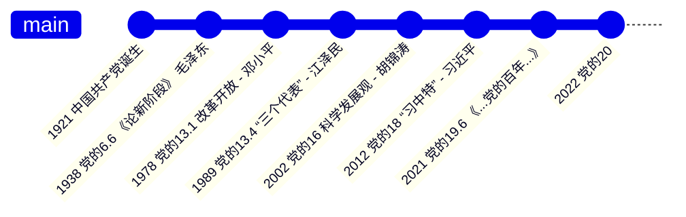

1. 新民主主义革命：浴血奋战，百折不挠
2. 社会主义革命和建设：自力更生，发愤图强
3. 改革开放/社会主义现代化/中国特色社会主义：解放思想，锐意进取
4. 习近平新时代中国特色社会主义：自信自强，守正创新

毛泽东思想：(1), (2)

邓小平思想：(3)


```title="做题"
1) 5~7, 9

2) 1~8

3) 辩证唯物主义，历史唯物主义，唯物史观；中国化，时代化；毛泽东思想 是马克思主义中国话时代化的历史性飞跃

4）1~18
```

