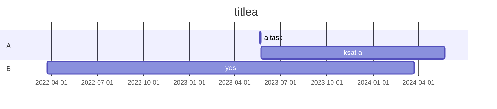
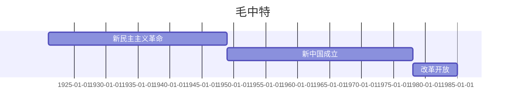

!!! 要求

立项材料：**6.16之前交给团支书**

1. [返家乡暑期社会实践报名流程](file:///D:/qq_files/download/2023%E5%B9%B4%E2%80%9C%E8%BF%94%E5%AE%B6%E4%B9%A1%E2%80%9D%E6%9A%91%E6%9C%9F%E7%A4%BE%E4%BC%9A%E5%AE%9E%E8%B7%B5%E5%B2%97%E4%BD%8D%E6%8A%A5%E5%90%8D%E6%B5%81%E7%A8%8B%20(1).pdf)
2. [优秀大学生赴试点村（社区）挂职锻炼项目（可纳入实践认定）](https://tw.cwxu.edu.cn/info/1164/2119.htm)
3. [2023年学校暑期社会实践学院介绍信](file:///D:/qq_files/download/%E9%99%84%E4%BB%B68%EF%BC%9A2023%E5%B9%B4%E5%AD%A6%E6%A0%A1%E6%9A%91%E6%9C%9F%E7%A4%BE%E4%BC%9A%E5%AE%9E%E8%B7%B5%E4%BB%8B%E7%BB%8D%E4%BF%A1.pdf)
4. [《关于开展2023年我校大学生志愿者暑期文化科技卫生“三下乡”社会实践活动的通知》](https://tw.cwxu.edu.cn/info/1164/2114.htm)
5. 团队命名：无锡学院+院名+ XXXX小分队
6. 社会实践的材料需要提交：全部材料务必保存好，**需要单位盖章**
7. “创青春”微信公众号，中青校园，到梦空间

!!! 记录
1. 附件[1](https://tw.cwxu.edu.cn/system/_content/download.jsp?urltype=news.DownloadAttachUrl&owner=1491699577&wbfileid=12256862)，[2](https://tw.cwxu.edu.cn/system/_content/download.jsp?urltype=news.DownloadAttachUrl&owner=1491699577&wbfileid=12256863)：立项
2. 附件[3](https://tw.cwxu.edu.cn/system/_content/download.jsp?urltype=news.DownloadAttachUrl&owner=1491699577&wbfileid=12256881)：校级重点团队名额分配
3. 附件[4](https://tw.cwxu.edu.cn/system/_content/download.jsp?urltype=news.DownloadAttachUrl&owner=1491699577&wbfileid=12256882)，[5](https://tw.cwxu.edu.cn/system/_content/download.jsp?urltype=news.DownloadAttachUrl&owner=1491699577&wbfileid=12256883)：校级重点团队申请
4. 附件[6](https://tw.cwxu.edu.cn/system/_content/download.jsp?urltype=news.DownloadAttachUrl&owner=1491699577&wbfileid=12256884)，[7](https://tw.cwxu.edu.cn/system/_content/download.jsp?urltype=news.DownloadAttachUrl&owner=1491699577&wbfileid=12256885)：结题书
5. 附件[8](https://tw.cwxu.edu.cn/system/_content/download.jsp?urltype=news.DownloadAttachUrl&owner=1491699577&wbfileid=12256886)：介绍信；附件[9](https://tw.cwxu.edu.cn/system/_content/download.jsp?urltype=news.DownloadAttachUrl&owner=1491699577&wbfileid=12256887)/[10](https://tw.cwxu.edu.cn/system/_content/download.jsp?urltype=news.DownloadAttachUrl&owner=1491699577&wbfileid=12256888)：旗帜
6. 需求
	- 附件7的“视频”：3-5分钟($\le$ 200M；720p)
	- 附件7的“暑期社会实践调研报告”：2000字，30%查重率
	- 附件7的“活动图片”：8张
	- 附件7的日记：不少于300字

- [大学生暑假社会实践报告（万能版本）](https://zhuanlan.zhihu.com/p/405665810)
- [大学生暑假社会实践报告(万能版本)](https://zhuanlan.zhihu.com/p/468817356)

[通知](https://tw.cwxu.edu.cn/info/1164/2114.htm)

!!! question
	1. 怎么报名：“创青春”公众号？中青校园？到梦空间？
	2. 

[思维导图](https://mm.edrawsoft.cn/wx.html?work_id=17421)

!!! index
	0. 马克思主义中国化的 历史进程&理论成果：提出，内涵，历史进程，理论成果&&关系，学习方法
	1. 毛泽东思想 && 历史地位：形成&发展，主要内容&活的灵魂，历史地位
	2. 新民主主义革命理论：形成依据；总路线&基本纲领；道路&基本经验
	3. 社会主义改造理论：新民主主义 -> 社会主义 的转变；道路&历史经验；基本制度
	4. 社会主义建设道路 初步探索的理论成果：重要成果；意义&经验教训
	5. 中国特色社会主义理论体系 的形成发展：社会历史条件；过程
	6. 邓小平理论：理论问题&精髓；主要内容；历史地位
	7. “三个代表”重要思想：核心观点；主要内容；历史地位
	8. 科学发展观：科学内涵；主要内容；历史地位

历史地位；革命论，改造论；初步探索，体系形成；邓三科

!!! note "党的人民代表大会"
	- 党的“几大”，“几届”，“几中”
		- `x大`：中国共产党第 x 次全国代表大会，5 年一次
		- `x届`：第 x 届中央委员会，对应于 `x大`
		- `x届y中全会`：第 x 届中央委员会第 y 次全体会议
		- 参考：[如何理解党的几大、几届、几中](https://zhuanlan.zhihu.com/p/144666676)
	- 会议的时间：
		- $a_{1..10} \equiv [21, 22, 23, 25, 27; 28, 45, 56, 69, 73] \pmod {100}$
		- $a_{11}\% 100=77, a_i=a_{i-1}+5, i\ge 12$
		- 注：在 11 大之后，5 年 1 大，1 年 1 中

!!! note "全国人民代表大会"
	- 会议的时间：
		- $a_{1..5} \equiv [54, 59, 64, 75, 78] \pmod {100}$
		- $a_5=78, a_i = a_{i-1}+5, i\ge 6$

!!! note "0.概论"
	- `19`：中共-new
	- `38`：党的6届6中，毛《论新阶段》，“马克思主义中国化”
	- `19-49`：毛，新民主主义革命，“浴血奋战，百折不挠”
	- `49`：新中国-new
	- `56`：三大改造-end
	- `49-56`：新民主主义社会；社会主义革命，最为广泛而深刻的社会革命，“自力更生，发愤图强”
	- `78`：党的11届3中，改革开放/社会主义现代化-new
	- `78-012`：中国特色社会主义，“解放思想，锐意进取”
	- `012-`？：习近平新时代中国特色社会主义，“自信自强，守正创新”
	- `018`：13大1次会议，国家指导思想为：`邓三科, 马毛习`(邓小平理论，“三个代表”重要思想，科学发展观，马克思列宁主义，毛泽东思想，习近平新时代中国特色社会主义)

!!! note "1."
	- `27`：三湾改编，毛 率领秋收起义不对到三湾村对部队进行改编；确立党对军队的领导
	- `35`：遵义会议
	- `45`：7大，毛泽东思想写入党章
	- ``

!!! note "1."
	- 三大法宝：统一战线，武装斗争，党的建设
	- 毛 的活的灵魂：基本方面：实事求是，群众路线（人民群众是历史的创造者），独立自主

!!! note "2."
	- `17`：俄国十月革命，世界无产阶级革命新纪元
	- `19`：五四运动，新民主主义革命-begin
	- `27-37`：
	- `840-49`：近代中国，半殖民地半封建社会；帝国主义 和 中华民族 的矛盾

!!! note "2."
	- 工农武装割据
	- 中国革命的敌人：封建主义，帝国主义(首要)，官僚资本主义

