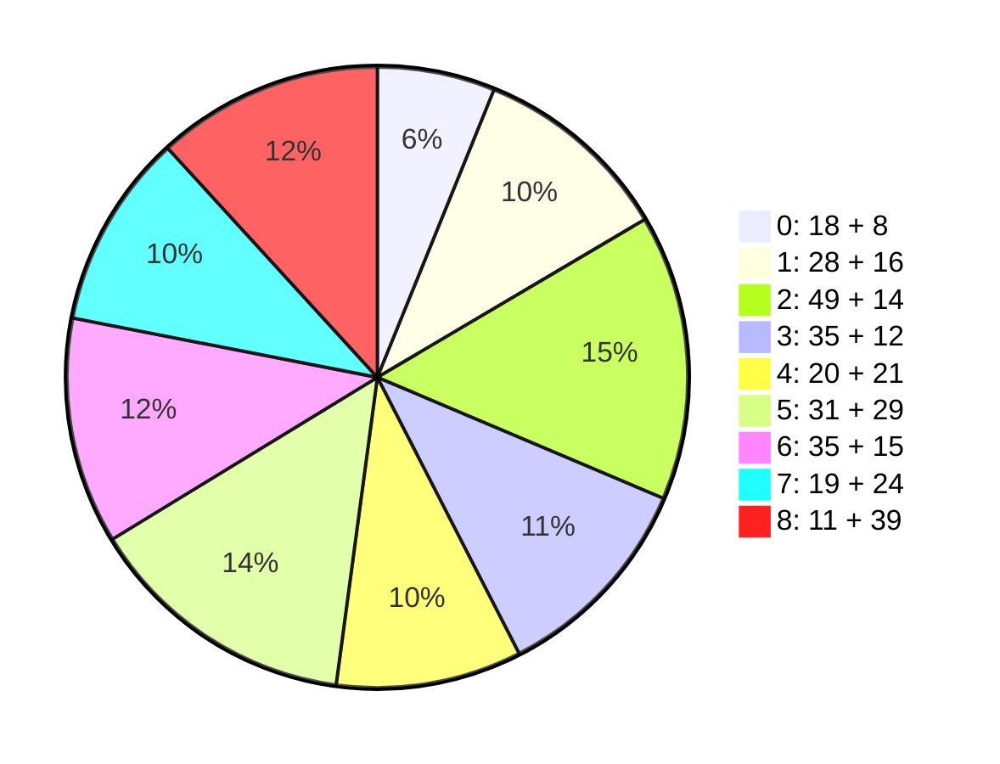

### 量化 ###

### 1.毛泽东思想&&历史地位 ###

!!! note "28 + 16"
	1. 单选
		1. 19世纪中叶，马恩提出 **唯物史观，剩余价值**，创立 **科学社会主义**
		2. 19世纪末20世纪初，世界进入 帝国主义 和 无产阶级革命 时代，**战争与革命**（~~和平与发展，世界大同，相互孤立~~）成为时代主题
		3. **俄国十月革命**开辟了 世界无产阶级社会主义革命 的新时代，给中国送来 **马克思列宁主义**
		4. **遵义会议**挽救了党，红军，中国革命
		5. **党的六届七中全会**确立毛泽东的领导地位（《关于若干历史问题的决议》）
		6. **党的七大**将毛泽东写入党章
		7. 新民主主义革命理论的基本点：3点
		8. 武装斗争 是无产阶级领导的，以 **农民** 为主体的革命战争
		9. 中共在革命中战胜敌人的 3 大法宝：**统一战线**，**武装斗争**，**党的建设**
		10. 建立社会主义制度后，毛泽东探索社会主义道路的思想和方针：3 个
		11. **三湾改编**从组织上确立党对军队的领导
		12. 三湾改编的主要内容：在政治上官兵平等，成立各级士兵委员会，实行民主制度
		13. 毛泽东的对敌策略：区别对待、分化瓦解；争取多数、反对少数、各个击破；有理、有利、有节
		14. 无产阶级及其政党实现对同盟者的领导的必要条件：3个
		15. **毛泽东思想的活的灵魂**的基本方面：**实事求是**，**群众路线**，**独立自主**
		16. 毛泽东在《反对本本主义》中提出“没有调查，没有发言权”
		17. **党的六届六中**，毛泽东以 **“实事求是”** 为题，提倡马克思主义同中国实际相结合
		18. 经过延安整风和党的七大，实事求是的路线在全党得到了确立
		19. 实事求是的内涵：一切从实际出发，理论联系实际，坚持在实践中检验真理和发展真理
		20. 坚持实事求是的正确做法：深入了解事物的本来面貌，把握事物内在必然联系，按照客观规律办事
		21. 坚持实事求是的具体做法：立足于基本国情；纠正因循守旧，故步自封的观念和想法
		22. 群众路线 对应于 马克思主义：“**人民群众**是历史的创造者”
		23. 同(16)
		24. 独立自主的内涵：独立思考，走自己的路；维护民族独立，捍卫国家主权；把立足点放在依靠自己的力量的基础上，同时积极争取外援，开展国际经济文化交流
		25. 符合独立自主的政策：以和平的方式解决国际争端；反对各种形式的霸权主义和强权政治；反对以强凌弱
		26. 正确的做法：以通俗语言解释深刻道理，废止“洋八股”，反对教条主义，表达方式上具有鲜明的民族特色
		27. 对历史人物的正确评价：放在取所处时代和社会历史条件来分析
		28. **党的十一届六中**，《党的若干问题的决议》，对毛泽东思想的评价
	2. 多选
		1. 毛泽东思想的发展时期：新民主主义革命，社会主义革命，社会主义建设
		2. 毛《中国社会各阶段的分析》，《湖南农民运动考察报告》：提出各阶级的作用，农民斗争的重要性，新民主主义革命的基本思想
		3. 土地革命：农村包围城市，武装夺取政权
		4. 毛《中国的红色正确为什么能够存在？》，《井冈山的战争》，《星星之火，可以燎原》，《反对并本本主义》：指明中国革命发展规律，阐述农村包围城市，武装夺取政权的思想；毛泽东思想初步形成
		5. 毛《实践论》，《矛盾论》：运用马克思主义的认识论和辩证法，分析党内“左”的和“右”的错误思想根源
		6. 毛《实践论》，《中国革命和中国共产党》，《新民主主义论》，《论联合政府》：新民主主义革命的对象，动力，领导力量，性质，前途
		7. 《七中二届报告》，《论人民民主专政》，《论十大关系》，《关于正确处理人民内部矛盾的问题》：社会主义革命/建设的思想，毛泽东思想的发展
		8. 农民为主要成分的革命军队 `->` 无产阶级性质，具有严格纪律，同人民群众保持亲密联系 的新型人民军队
		9. 惩前毖后，治病救人：针对“左”的错误
		10. 谦虚，谨慎，不骄，不躁
		11. 辩证唯物主义，历史唯物主义
		12. 毛《实践论》，《矛盾论》：理论对实践的依赖关系，矛盾普遍性和特殊性关系
		13. 发挥人民群众的历史主体作用：调动人民的积极性，主动性，创造性
		14. 毛思想：新民主主义革命，社会主义革命/建设，军队/国防建设，政策和策略，思想/文化/外交工作，党的建设
		15. 毛思想的现实指导作用：4个
		16. 毛的贡献：中国共产党创立 & 发展，中国人民解放军的创立 & 发展，中国各族人民解法事业的胜利，中华人民共和国的缔造 & 社会主义事业的发展

- 毛泽东
	- 6.6(实事求是)，6.7(领导地位)，7.0(写入党章)
	- 活的灵魂：实事求是，群众路线，独立自主
	- 实事求是：15~21
	- 群众路线：22
	- 独立自主：23~25

### 2. 新民主主义革命理论(1919-1945) ###

!!! note "49 + 14"
	1. 单选
		1. 中国不可能发展为资本主义国家的原因：3 个
		2. 半殖民地，半封建的近代中国的主要矛盾：帝国主义和中华民族的矛盾
		3. 资本主义 `->` 社会主义：俄国十月革命
		4. 新民主主义革命开始的标志：五四运动
		5. 推翻君主专制制度，但未改变社会性质(半殖民地半封建)的运动：孙中山 - 辛亥革命
		6. 党形成的适合中国国情的革命理论：新民主主义
		7. 党开展延安整风(1941-1945)，提高马克思主义水平的时期：抗日战争(1931-9.18~1945)
		8. 使全党对中国革命基本问题的认识达到一致的文件：《关于若干历史问题的决议》
		9. 毛泽东提出“新民主主义革命”的文件：《中国革命和中国共产党》
		10. 毛泽东总结“新民主主义革命”总路线的文件：《在普绥干部会议上的讲话》
		11. 新民主主义革命的理解：**无产阶级**领导，**反帝反封建反官僚资本**，人民的革命
		12. 新民主主义革命的“友”：民族资产阶级
		13. 中国革命的首要对象：帝国主义
		14. 中国社会进度的障碍：帝国主义
		15. 地主阶级：剥削压迫农民的阶级，帝国主义统治中国&封建军阀实行专制统治的社会基础，中国经济现代化&政治民主化的主要障碍
		16. 反对封建主义：消灭封建的官僚军阀专制统治(政治)，消灭封建土地所有制(经济)，为中国的经济现代化和政治民主化创造条件
		17. 官僚资本主义：通过国家垄断金融机构，滥伐纸币和国债而疯狂侵吞社会财富；通过家里国家专卖制度控制大量商品和物资而压迫和兼并私人资本主义企业
		18. 社会主要矛盾/革命的主要对象：大革命时期(1924-1927)`->`帝国主义支持下的北洋军阀；土地革命(1927-1937)`->`国民党新军阀；抗日战争(1931-1945)`->`日本帝国主义；解放战争时期(1946-1949)`->`美帝国主义支持下的国民党反动派
		19. 大革命时期的革命对象：见(18)
		20. 土地革命战争时期的革命对象：见(18)
		21. 抗日战争时期的革命对象：见(18)
		22. 解放战争时期的革命对象：见(18)
		23. 中国革命最基本的动力：无产阶级
		24. **无产阶级**的描述：近代中国最进步的阶级，伴随着外国帝国主义在中国直接经营企业而产生，社会生产力的代表，与中国民族工业的产生有关
		25. 中国革命的主力军：农民
		26. 城市小资产阶级：知识分子，小商人，手工业者
		27. 对待民族资产阶级：争取民族资产阶级(政治)，保护民族工商业(经济)，对民族资产阶级又斗争又联合
		28. **无产阶级**的优点：与先进的生产方式想联系，没有私人占有的生产资料，富于组织纪律性
		29. **中国无产阶级**的优点：分布集中，有利于无产阶级队伍组织和团结；大部分出身于破产农民，和农民有着天然的联系；革命斗争中币其他阶级更坚决和彻底
		30. 共产党成为农民和革命民主派的领导者的原因：中国没有代表农民的政党；民族资产阶级的政党没有坚决土地纲领
		31. **新/旧民主主义革命相比**，前者的特点：中国共产党领导，马克思主义作为思想指导，“新革命”是世界无产阶级社会主义的一部分
		32. **新民主主义革命与社会主义革命的不同**：前者联合民族资产阶级一起反对共同敌人(政治)，前者保护民族工商业(经济)，前者属于资产阶级民主主义革命
		33. 毛《新民主主义论》：阐述新民主主义的政治，经济，文化
		34. 毛《论联合政府》：把新民主主义的政治，经济，文化与党的纲领联系起来
		35. 新民主主义**政治纲领**：推翻帝国主义和封建主义的统治；建立无产阶级领导的，工农联盟为基础的，各革命阶段联合专政的新民主主义的共和国；新民主主义共和国不同于欧美式的资产阶级专政的国家
		36. 新民主主义国家的**国体**：无产阶级领导，以工农联盟为基础(小资产阶级，民族资产阶级，反帝反封建的人们在内的各革命阶级)的联合专政
		37. 新民主主义的**经济纲领**：没收官僚资产阶级的垄断资本并且归国家所有，保护民族工商业，没收封建地主阶级的土地，没收封建地主阶级的土地归农民所有
		38. 土地改革的主要任务：满足贫雇农的要求
		39. 土地革命的路线：依靠贫雇农；团结中农；有步骤，有分别地消灭封建剥削制度
		40. 新民主主义**文化**：反对帝国主义，主张中华民族的尊严和独立；尊重中国历史，反对民族虚无主义；具有鲜明的民族风格，民主形式，民族特色
		41. 新民主主义文化是民族的：主张中华民族的尊严和独立；具有鲜明的民族风格，民族形式，民族特色；大量吸收外国的进步文化
		42. 新民主主义文化是科学的：反对一切的封建思想和迷信思想；主张实事求是，客观真理及理论和实践的一致性；以历史唯物主义的态度对待古今中外文化
		43. 新民主主义文化是大众的：普及于大众又提高大众；在革命前是革命的思想准备；在革命过程中是革命总战线中的一条必要和重要的战线
		44. 1927大革命失败，党工作重心转向：农村
		45. 中国革命必须走农村包围城市，武装夺取政权的道路，具体体现在：资本主义国家需要经过长期的，公开的合法斗争，再组织武装起义，夺取政权；中国革命的主要斗争形式只能是武装斗争，以革命的武装消灭反革命的武装，相应的组织形式必然是军队；必须充分地发动农民，否则无法摧毁帝国主义和封建地主阶级反动统治的基础
		46. 毛《<共产党人>发刊词》总结中国革命两次胜利和两次失败的经验教训，提出统一战线，武装斗争，党的建设是党在中国革命中战胜敌人的三大法宝(1939-10)
		47. 统一战线的说法：建立巩固的工农联盟；在联合民族资产阶级的过程中，在思想/政治/组织上进行必要的斗争；保持党在政治/组织/思想上的独立性
		48. 民主集中制的原则：个人服从组织，下级服从上级，全党服从中央
		49. 毛《论人民民主专政》：概括新民主主义革命的基本经验，丰富/发展马克思主义关于无产阶级领导人民革命的理论
	2. 多选
		1. 帝国主义使中国半殖民地半封建化的表现：破坏领土完整，勒索巨额“战争赔款”，享有领事裁判权，控制海关
		2. 中国占支配地位的主要矛盾：帝国主义和中华民族的矛盾，封建主义和人民群众的矛盾
		3. 不能完成反帝反封建的革命任务：4 个
		4. 党幼年时期推动国民党改组和国民革命军建立领导反帝反封建的运动（大革命高潮）：工人运动，青年运动，农民运动，妇女运动
		5. 无产阶级诞生于半殖民地半封建社会，主要组成是：铁路，矿山，海运，纺织，造船等产业的工人
		6. 反对官僚资本主义的原因：其与外国资本主义，本国地主阶级，旧式富农密切地结合；其与大地主资产阶级的反革命国家政权密切结合，成为国民党统治的经济基础；它是买办的封建的国家垄断资本主义；它对中国经济发展和社会进步起着严重的阻碍作用
		7. 毛“工农武装割据”思想，农村包围城市革命道路理论：《中国的红色政权为什么能够存在？》，《井冈山的斗争》，《星星之火可以燎原》
		8. 农民，城市小资产阶级，其他中间阶级 团结形成统一战线
		9. 新民主主义革命时期的统一战线：第一次国共合作的统一战线，工农民主统一战线，抗日民族统一战线，人民民主统一战线
		10. 党在新民主主义革命时期建设人民军队的经验：坚持党对军队的绝对领导，建设全心全意为人民服务的人民军队，开展革命的政治工作；坚持正确的战略战术原则
		11. 人民军队政治工作的基本原则：官兵一致，军民一致，瓦解敌军，优待俘虏
		12. 党加强自身建设的经验：**思想建设**始终放在党的建设的首位；始终重视**组织建设**；重视**作风建设**；联系党的政治路线加强党的建设
		13. 大革命失败后，党内“左”倾教条主义着的错误：主张“城市中心论”；对统一战线的重要性缺乏认识；把中间势力当作最危险的敌人；把 反对资本主义 和 反帝反封建 相提并论；
		14. 党的优良作风：理论联系实际，密切联系群众，批评与自我批评相结合

!!! 补充
	- 两次胜利，两次失败：1927基本推翻北洋军阀，1936红军长征胜利；1927国民党右派叛变革命，大革命失败；1934红军第五次反“围剿”失败，被迫进行长征

### 3. 社会主义改造理论(三大改造) ###

记 $S_1$ 为新民主主义(1919-1945)，$S_{11}$ 为大革命(1924-1927)，$S_{12}$ 为土地革命(1927-1937)，$S_{13}$ 为抗日战争(1931-1945)

记 $S_2$ 为社会主义

!!! note "35 + 12"
	1. 单选
		1. 新民主主义 `->` 社会主义 的过渡期：新中国成立 `->` 社会主义改造基本完成
		2. 新民主主义社会中的经济成分：社会主义性质的**国营经济**，农民和手工业者的**个体经济**，**私人资本主义经济**
		3. 新民主主义社会扩大**国营经济**，将**个体经济**和**资本主义经济**改变为**社会主义经济**
		4. $S_1$ 时期的阶级：工人/农民/民族资产阶级
		5. $S_{12}$ 基本完成后的主要矛盾：工人阶级和资产阶级的矛盾
		6. 党的 7.2 的**两个转变**：由农业国转变为工业国，由新民主主义国家转变为社会主义国家
		7. 1949-1952 **恢复经济**，继续完成**民主革命遗留任务**的成就：完成土地改革，镇压反革命运动，开展 “三反” “无反” 运动
		8. 1952：国民经济恢复，民主革命遗留任务已经完成，政治/经济/社会面貌发生巨大变化
		9. 党在过渡时期的总路线 “一化三改”：“三改”指的是对 个体农业/手工业/工商业 的社会主义改造
		10. 对党在过渡时期的总路线的认识：体现社会主义工业化和社会主义改造的紧密结合，解放生产力与发展生产力的有机统一，变革生产关系与发展生产力的有机统一
		11. 马恩《共产党宣言》：工人革命第一步是使无产阶级上升为统治阶级
		12. 新民主主义时期的国际形势：苏联社会主义比资本主义更具优越性，资本主义国家不景气，朝鲜战争停战
		13. 农业社会主义改造道路的描述：不能采取剥夺(引导/说服/教育)；依靠贫下中农/消灭富农剥削；高级农业生产合作社的生产资料归集体所有，取消土地报酬，实行按劳分配
		14. 农业/手工业社会主义改造的自愿互利原则：说服教育/典型示范/国家帮助；农民/手工业者加入合作社时，合理处理生产资料入社的折价/收益补偿问题；农民/手工业者入社后，处理好各方面的经济关系/收益分配问题
		15. 互助组：解决农业生产过程中劳动力/畜力/农具不足的困难，由农民自愿组成，具有社会主义萌芽性质
		16. **初级农业生产合作社**：以土地入股，耕畜/农具作价入社，由社实行统一经营；劳动产品按劳分配 + 土地入股分红；具有**半社会主义性质**
		17. **高级农业生产合作社**：取消土地报酬；**社会主义性质**的集体经济组织；按劳分配
		18. **个体手工业经济**：以**生产资料私有制**和**个体劳动**为基础；规模狭小；经营分散
		19. 手工业供销小组：由独立手工业者/家庭手工业者通过由国营商业或供销合作社供给原料和报销产品，推销成品通过**加工订货**方式组织起来；摆脱了工业资本/商业资本/高利贷的剥削和控制；具有**社会主义萌芽性质**
		20. 手工业**供销**合作社：由供销合作社 供应原料/推销产品/加工订货；具有**半社会主义性质**；生产活动由社员扥收纳独立完成
		21. 手工业**生产**合作社：在国家计划指导下，根据市场需要灵活安排，采取集中生产/分散生产/流动服务等经营方式；生产资料归社员集体所有；采取个人/小组 计件/计时工资 加 奖励/分成工资等形式
		22. 对**资本主义工商业**进行社会主义改造：将工人阶级和民族资产阶级的对抗性矛盾转化为非对抗性矛盾，按照人民内部矛盾来处理；采取从低级到高级的国家资本主义的过渡形式；把资本主义工商业者改造成为自食其力的社会主义劳动者
		23. 对资本主义工商业实行**和平赎买**：有利于发挥私营工商业在国计民生方面的积极作用；有利于争取和团结民族资产阶级；有利于发挥民族资产阶级中大多数人的知识/才能/技术专长/管理经验
		24. 外国能对对资本主义工商业实行**和平赎买**的原因：民族资产阶级既有剥削工人取得理论的一面，又有拥护党的领导，用户宪法，愿意接受社会主义改造的一面；党和民族资产阶级长期保持统一战线；外国建立了强大的社会主义国营经济，掌握看国家经济命脉
		25. **国家资本主义经济**：由人民政府管理；用各种形式和国营社会主义经济联系着；受工人监督
		26. 国家资本主义的高级形式：公私合营(~~统购包销，委托加工，计划订货 ~~)
		27. 对**资本主义工商业**进行社会主义改造(资本主义工商业者 `->` 社会主义劳动者)的意义：对企业的改造和对人的改造相结合；改造资本家个人和消灭他们所属的资产阶级相结合；避免阶级对抗，减少了改造的阻力
		28. 社会主义改造的历史经验：坚持社会主义建设与社会主义改造同时并举；积极引导，初步过渡；和平方法进行改造
		29. 1956 社会主义改造基本完成，**“一五”计划**提前完成；1957 各项指标均超额完成
		30. “一五”的大规模建设，以**重工业**为中点的社会主义工业化基础已初步建立
		31. 社会主义改造和**社会主义工业化**同时并举的意义：保持社会稳定，改善人民生活，推动社会进步
		32. 1956年底，对 农业/手工业/资本主义工商业 的社会主义改造基本完成；农业，手工业个体所有制转变为劳动群众集体所有的公有制
		33. 1954-9 第一届全国人民代表大会，《中华人民共和国宪法》
		34. 社会主义基本制度 `->` 社会主义经济制度 和 社会经济结构 变化 `->` 阶级关系变化：帝国主义侵略势力已经被清除出中国大陆；官僚资产阶级已经在中国国内被消灭；广大劳动人民从此摆脱了被剥削被奴役的地位
		35. 社会主义基本制度证明了马克思主义的真理性？丰富和发展了科学社会主义
	2. 多选
		1. 社会主义国营经济的优越性：大多比较技术先进，劳动生产率比较高，职工生活稳定，职工主人翁意识强
		2. 互助合作形式：帮贫下中农战胜自然灾害/克服困难，帮贫下中农增加生产，避免农村两极分化，引导农业想社会主义方向发展
		3. 农业改造的原则：自愿互利，典型示范，国家帮助
		4. 党在农村的依靠力量：贫农，下中农
		5. 手工业改造的方针：积极领导，稳步前进
		6. 手工业改造的方法：说服教育，典型示范，国家帮助
		7. 初级国家资本主义：对私营工商业实行 委托加工/计划订货/统购包销/经销代销
		8. 初级国家资本主义：对私营工商业的利润实行 国家所得税/企业公积金/工人福利费/资方红利 等分配
		9. 资本主义工商业改造：在政治上适当安排，在工作上发挥作用，在生活上妥善照顾
		10. 对农业/手工业/资本主义工商业改造的方式：区别对象，积极引导，逐步过渡
		11. 资产阶级和平赎买的作用：扩大生产，维持就业，增加税收
		12. 社会主义建设对 教育/科学/文化/卫生 有很大发展

工人阶级 与 资产阶级 

- 农业：互助组，初级农业生产合作社，高级农业生产合作社(生产资料集体所有，无 土地报酬)
- 手工业：个体，供销小组(未解决分散生产)，供销合作社(生产资料归功所有)，生产合作社
- 资本主义工商业：和平赎买
- 国家资本主义经济：初级(委托加工/计划订货/统购包销/经销代销)，高级
- “一五”

- 1949-1952：土地改革，国民经济恢复时期；1952-1956：社会主义改造时期，三大改造

### 4. 社会主义建设道路初步探索的理论成果 ###

!!! note "20 + 21"
	1. 单选
		1. 毛[《论十大关系》](https://www.gov.cn/test/2009-08/26/content_1401631.htm)：总结社会主义建设经验，以史为鉴，独立自主探索社会主义建设道路
		2. 毛《关于正确处理人民内部矛盾的问题》(1957, 党的八大前后)：社会主义矛盾的理论
		3. 党的8.0指出主要矛盾：人民对于经济文化迅速发展的需要同当前经济文化不能满足人民需要的状况之间的矛盾
		4. 人民内部矛盾：工人，农民同知识分子之间的矛盾；政府与人民群众之间的矛盾；国家机关某些工作人员的官僚资本主义作风同群众之间的矛盾
		5. 人民民主专政解决人民内部矛盾：讨论，批评，说服教育
		6. 针对人民内部矛盾的不同方针：民族平等，团结互助(民族矛盾)；“百花齐放，百家争鸣”(科学文化矛盾)；“长期共存，互相监督”(共产党和民主党派的矛盾)
		7. 毛《关于正确处理人民内部矛盾的问题》：中国工业化道路（重工业，轻工业，农业的发展关系）
		8. 毛：以**农业**为基础，以**工业**为主导；“两条腿走路”的工业化发展思路
		9. **工业化发展思路**：重工业和轻工业同时并举；中央工业和地方工业同时并举；大型企业和中小型企业同时并举
		10. 工业化道路，经济建设方针：处理国家，集体，个人的关系；顾全大局，突出重点；统筹兼顾，全面安排，综合平衡
		11. 陈云“三个主体，三个补充”：一定数量的**个体经济**是**国家经济**和**集体经济**的补充；按照市场变化在国家计划许可范围内的**自由生产**是**计划生产**的补充；**计划生产**是**工农业生产**的补充
		12. “两参一改三结合”的企业管理制度：干部参加生产劳动，工人参加企业管理；改革不合理的规章制度；工人群众，领导干部，技术人员三结合
		13. 周恩来“四个现代化”
		14. “四个现代化”：农业，工业，**科学技术**，国防
		15. 20世纪60年代前期，美国队越南北方侵略战争逐步扩大
		16. “三线建设”：云南，贵州，甘肃
		17. 新中国建立之初，中国站在社会主义阵营一边
		18. 1953提出和平共处五项原则
		19. 毛“两个中间地带”：亚洲，非洲，拉丁美洲（亚非拉）；欧洲，北美加拿大，大洋洲（欧北大）
		20. 毛“三个世界划分”：
	2. 多选
		1. 《论十大关系》的前3条：重工业/轻工业/农业的关系，沿海/内地工业的关系，经济建设/国防建设的关系

### 5. 中国特色社会主义理论体系的形成发展 ###

!!! note "31 + 29"
	1. 单选
		1. 20世纪70年代，和平与发展为时代主题：美苏冷战格局重大变化；经济全球化深入发展使世界经济紧密联系；新科技革命推动经济社会快速发展
		2. 苏联解体后，美国成为唯一的超级大国
		3. 以美国为首的霸权主义，强权政治
		4. 20世纪80年代末90年代初的国际背景：美国霸权主义和强权政治；美国为超级大国，极力使世界向单极化发展；东欧剧变，苏联解体；恐怖主义危害上升
		5. 21世纪大变革大调整：世界多极化；经济全球化；国际力量朝着有利于维护世界和平的方向发展
		6. 经济文化落后的中国建设社会主义：时刻警惕西方资本主义的压力和渗透；坚决抵制抛弃社会主义的错误主张；自觉纠正僵化的错误观念
		7. 我国经济社会发展呈现的**阶段性特征**：经济实力显著增强；人民生活总体上达到小康水平；对外开放日益扩大
		8. 我国经济社会发展在**经济增长**上呈现的新的阶段性特征：长期形成的粗放型增长方式尚未根本改变；生产力水平总体上还不高；长期形成的结构性矛盾尚未根本改变
		9. 我国经济社会发展在**人民生活**上呈现的新的阶段性特征：收入分配差距拉大趋势还未根本扭转；城乡贫困人口还有相当数量；低收入人口还有相当数量
		10. 我国经济社会发展在**协调发展**上呈现的新的阶段性特征：农业基础薄弱的局面尚未改变；缩小城乡，区域发展差距任务艰巨；促进经济社会协调发展任务艰巨
		11. 1978 安徽省凤阳县小岗村的 18 户农民创造了包干到户(家庭联产承包责任制)
		12. 《实践是检验真理的唯一标准》冲破了“**[两个凡是](https://cn.bing.com/search?q=%E4%B8%A4%E4%B8%AA%E5%87%A1%E6%98%AF&cvid=7e57ae0350cb43a1b512c135abc821e0&aqs=edge.0.69i59&FORM=ANAB01&PC=NMTS)**”的严重束缚
		13. **真理标准大问题讨论**：为**党的 11.3** 的召开作了重要思想准备
		14. 1982邓小平在党的 13.0 指出：把马克思主义的普遍真理与我国具体实际结合起来
		15. 1984 **党的 12.3**《中共中央关于经济体制改革的决定》：社会主义经济是**公有制**基础上的**有计划**的**商品经济**
		16. 1987 **党的 13.0**：系统阐述社会主义初级阶段理论；阐发了党的**“[一个中心，两个基本点](https://cn.bing.com/search?pglt=161&q=%E4%B8%80%E4%B8%AA%E4%B8%AD%E5%BF%83%E4%B8%A4%E4%B8%AA%E5%9F%BA%E6%9C%AC%E7%82%B9&cvid=549c30ea1aa6447eb5e327b957cd62fd&aqs=edge.1.69i57j0l8.3176j0j1&FORM=ANNTA1&PC=NMTS)”**的基本路线
		17. 1997 **党的 15.0**：**邓小平理论**
		18. 1999 宪法修正案：邓小平理论载入宪法
		19. 1978 **党的 11.3**：确立实事求是的思想路线；彻底否定[“以阶级斗争为纲”](http://cpc.people.com.cn/n1/2019/0227/c69113-30904184.html)的错误理论和实践
		20. 1978 **党的 11.3**：把全党工作的着重点转移到**社会主义现代化建设**上，做出实行**改革开放**的重大决策，实现党的历史上具有深远意义的伟大转折
		21. 邓小平理论：继承和发展马克思主义，开拓马克思主义新境界
		22. **党的 14.4**《中共中央关于加强党的建设几个重大问题的决定》：分析了党的建设面临的形式
		23. 2001.7.1 **江泽民**在党成立 80 周年大会上阐述 **“三个代表” 重要思想**
		24. 《在庆祝党成立八十周年大会上的讲话》：回答了“在新的历史条件下建设一个什么样的党，怎样建设党”
		25. 2002 **党的 16.0**：将 马克思列宁主义，毛泽东思想，邓小平理论，**“三个代表”重要思想** 写入党章
		26. 2005 **党的 16.5**《中共中央关于制定国民经济和社会发展第十一个五年规划的建议》：**科学发展观**
		27. 2007 **党的 17.0**：将 **科学发展观** 写入党章
		28. **党的 16.3**《中共中央关于完善社会主义市场经济若干问题的决定》：第一次提出科学发展观
		29. 科学发展观：新形势下实现什么样的发展，怎样发展
		30. **党的 19.0**：**习近平新时代中国特色社会主义思想**写入党章
		31. 十三届全国人大一次会议 通过的 宪法修正案：习思想载入宪法
	2. 多选
		1. 

### 6. 邓小平理论 ###

!!! note "35 + 15"
	1. 单选
		1. 邓小平理论的基本理论问题：建设什么样的社会主义，怎样建设社会主义
		2. 列宁探索了社会主义发展道路问题；他逝世后，高度集中的苏联模式出现弊端
		3. 在坚持社会主义基本制度的基础上进一步认清社会主义的本质
		4. 1992年初邓小平南方谈话：对社会主义的本质做出总结性的理论概括
		5. **党的 11.3**：重新确立并发展实事求是的思想路线
		6. 邓《解放思想，实事求是，团结一致》：党的 11.3 的主题报告，党重新确立马克思主义的思想/政治/组织路线
		7. **解放思想**：坚持马克思主义为指导，敢于面对新情况新问题，把实践作为最高权威
		8. **社会主义初级阶段**的基本特征：是逐步摆脱贫穷，摆脱落后的阶段；是建立和发展社会主义经济/政治/文化体制的阶段；是全民奋起，艰苦创业，实现中华民族伟大复兴的阶段
		9. 社会主义初级阶段的论断：外国已经进入社会主义社会；外国必须坚持而不能离开社会主义；我国的社会主义社会还处于不发达阶段
		10. **党的 13.0**：提出社会主义初级阶段的基本路线（参见 (5.16)）
		11. 社会主义初级阶段基本路线之一：“以经济建设为中心”，即社会主义的根本任务
		12. 社会主义初级阶段基本路线之一：“坚持改革开放”，即社会主义的发展动力和外部条件
		13. 社会主义初级阶段基本路线之一：“坚持四项基本原则”，回答了：社会主义的本质要求；社会主义的根本任务；社会主义的发展动力和外部条件 的问题
		14. 1979 邓小平在党的理论工作务虚会上发表《坚持四项基本原则》
		15. 马恩《共产党宣言》：**无产阶级夺取政权**后，要大力**发展生产力**，并尽可能快地增加生产力总量
		16. **党的 11.3**：党将工作重点转移到经济建设上
		17. 1979.12 邓小平在同日本首先大平正芳的谈话中用“小康”来阐释“中国式的现代化”
		18. 邓小平[“三步走”](https://zhuanlan.zhihu.com/p/41436886)的第一步：1990年国民生产总值比1980翻一番，解决人民温饱问题
		19. 邓小平“三步走”的第二步：到20世纪末，GNP 翻一番，人民生活达到小康水平
		20. 邓小平“三步走”的第三步：到21世纪中叶，人均国民生产总值达到中等发达国家水平，人民比较富裕，基本实现现代化
		21. 为“三步走”现代化发展战略，战略重点有：农业，能源和交通，教育和科学
		22. 共同富裕：不等同于完全平均；发展过程中允许不平衡；全体社会成员共同富裕的道路上必然有先有后，快慢不一
		23. **党的 11.3**：党和国家的工作中心转移到经济建设上，实行改革开放
		24. 改革：社会主义制度的自我完善和发展；改革要从根本上改变束缚我国生产力发展的经济体制；改革要建立充满生机和活力的社会主义新经济体制
		25. 改革是崭新的事业，是一个大试验，其要求包括：胆子要大，步子要稳；不因循守旧，四平八稳；以[“三个有利于”](https://cn.bing.com/search?pglt=161&q=%E4%B8%89%E4%B8%AA%E6%9C%89%E5%88%A9%E4%BA%8E&cvid=6ef8482569d24e3a9226b58c02735f06&aqs=edge..69i57j0l8.4726j0j1&FORM=ANNTA1&PC=NMTS)为标准来判断改革和各方面工作的是非得失
		26. 对外开放：加强国际交往，引进发达国家的先进经验，先进科学技术，资金；发挥自己的比较优势，使国内经济与国际经济实现必要的互接互补；是对世界所有国家的开放
		27. **党的 14.0**：把建立社会主义**市场经济**体制作为我国经济体制改革的目标
		28. 社会主义市场经济：计划经济和市场经济不是划分社会制度的标志；市场经济把计划的手段和市场的手段结合起来；市场经济作为资源配置的一种方式，不具有制度属性
		29. 社会主义市场经济的特色和优势：社会主义制度 和 市场经济 相结合
		30. 1979全国人大常委《告台湾同胞书》：宣誓争取祖国和平统一的大政方针
		31. 1981叶剑英：发表台湾回归祖国，实现和平统一的方针政策的谈话，进一步阐明实现和平统一的九条方针政策
		32. 发展问题：南北问题，即发展中国家 与 发达国家 之间的关系问题
		33. 关于邓小平时代主题的判断：世界大战在一个相当长的时期内可以避免；世界和平是促进各国发展的前提条件；各国的共同发展是保持世界和平的重要基础
		34. 1953 [和平共处五项原则](https://www.12371.cn/2022/06/24/ARTI1656060375878187.shtml)：处理国与国之间关系的最好方式
		35. 邓小平理论围绕“什么是社会主义，怎么建设社会主义”的问题，系统回答了“在中国这样经济文化比较落后的东方打过建设，巩固，发展社会主义”的一系列基本问题，继承和发展了马克思列宁主义和毛泽东思想
	2. 多选
		1. 

- 1956~至今：社会主义初级阶段
- 党的13.0 “一个中心，两个基本点”的基本路线：以经济建设为中心，坚持四项基本原则(社会主义道路；无产阶级专政；党的领导；马列主义，毛泽东思想)，坚持改革开放
- 三步走(1980-1990, 1990-2000, 2000-2050)，新三步(2000-2010, 2010-2020, 2020-2050)，两步走(2020-2035, 2035-2050)：每段时间都要求 国民生产总值GNP 翻一倍，但实际上每次都超额完成
- 计划经济，市场经济

### 7. 三个代表重要思想 ###

!!! note "19 + 24"
	1. 单选
		1. 对于落后的生产方式：不能脱离实际地简单化地加以排斥；立足实际，创造条件加以改进/改造/提高；通过长期努力，逐步使它们相先进适用的生产方式转变
		2. 生产力中最活跃的因素：人
		3. 改革开放和**现代化建设**：营造尊重人才的社会环境；形成人才脱颖而出，人尽其才的良好体制；开创人才辈出并能充分发挥各种人才积极性和创造性的局面
		4. 发展生产力的决定因素：科技进步和创新
		5. 发展先进文化：支持健康有益文化；努力改造落后文化；坚决抵制腐朽文化
		6. 加强社会主义思想道德建设：加强社会公德/职业道德/家庭美德教育；广泛开展群众性精神文化建设活动；引导人们树立中国特色社会主义共同理想
		7. 新闻出版，广播影视：宣传科学理论，传播先进文化，弘扬社会正气
		8. 坚持正确舆论导向的做法：把体现党的意志同反映人民的心声结合起来；紧紧围绕经济建设这个中心？；服从服务于全党全国的大局
		9. 发展先进文化，需要充实社会主义文艺事业的发展：尊重作家艺术家的创造性劳动；坚持党的文艺工作方针；在艺术理论上提倡不同观点和学派的自由讨论
		10. 发展文化事业/产业需贯彻发展先进文化的要求，把**社会效益**放在第一位
		11. **党的 14.3**《关于建立社会主义市场经济体制若干问题的决定》：勾画了社会主义市场经济体制的蓝图和基本框架
		12. 2001.12 中国加入世界贸易组织，对外开放进入历史新阶段
		13. 改革，发展，稳定的关系：没有改革，就不可能走出一条建设中国特色社会主义的正确道路；没有发展，就不可能实现现代化；没有稳定，改革和发展就无从进行
		14. **党的 14.0**：同 6.27
		15. **公有制**的主体地位的体现：公有资产在社会总资产中占优势；**国有经济**控制**国民经济**命脉；国有经济对经济发展起主导作用
		16. **宏观调控**的主要目标：促进经济增长，稳定物价，保持国际收支平衡
		17. **政治体制改革**是社会主义政治制度的自我完善和发展
		18. 对待资本主义：充分看到 学习/借鉴/合作/利用 的一面；大胆学习和借鉴资本主义国家的一切好东西；坚决抵制各种腐朽的东西和反映资本主义本质属性的东西
		19. “三个代表”重要思想：进一步回答“什么是社会主义，怎么建设社会主义”的问题，创造性回答了“建设什么样的党，怎么建设党”的问题，进一步深化了中国特色社会主义的认识
	2. 多选
		1. 

### 8. 科学发展观 ###

!!! note "11 + 39"
	1. 选择
		1. 加快经济转变发展方式：把科技进步和创新作为重要支撑；把保障和改善民生作为出发点和落脚点；把建设资源节约型，环境友好型社会作为重要着力点
		2. **党的 16.0**：在本世纪头二十年全面建设小康社会
		3. **党的 17.0**：根据形式发展提出了全面建设小康社会的新要求
		4. 中国古代的**民本思想**：在一定程度上起到缓和阶级矛盾的作用；体现了朴素的重民价值取向；站在**唯心史观**的立场上
		5. 近代西方的**人本主义**：对于反对封建主义，推进人的解放起到一定的积极作用；在本质上是为资产阶级取得和维护统治地位服务的；站在**唯心史观**的立场上
		6. **全面协调可持续**：“全面”是指发展的全面性，整体性；“协调”是指发展要有协调性，均衡性；“可持续”是指发展要有持久性，连续性
		7. **以人为本**：科学发展观的**核心立场**，集中体现马克思主义基本原理，体现党全心全意为人民服务的宗旨和推动经济社会发展的根本目的，是社会主义的本质特征
		8. 科学发展观的基本要求：全面发展，协调发展，可持续发展
		9. **统筹兼顾**：科学发展观的根本方法，深刻体现了**唯物辩证法**在发展问题上的科学运用
		10. 2006.1.1 废止《中华人民共和国农业税条例》
		11. 转变经济发展方式：不能一眼前利益损害长远利益，不能以牺牲环境为代价去换取一时的经济增长，不能用局部发展损害全局利益

### t1 马克思主义中国化新的飞跃 ###

### t2 坚持和发展中国特色社会主义的总任务 ###

### t3 坚持党的全面领导 ###

### t4 坚持以人民为中心 ###

