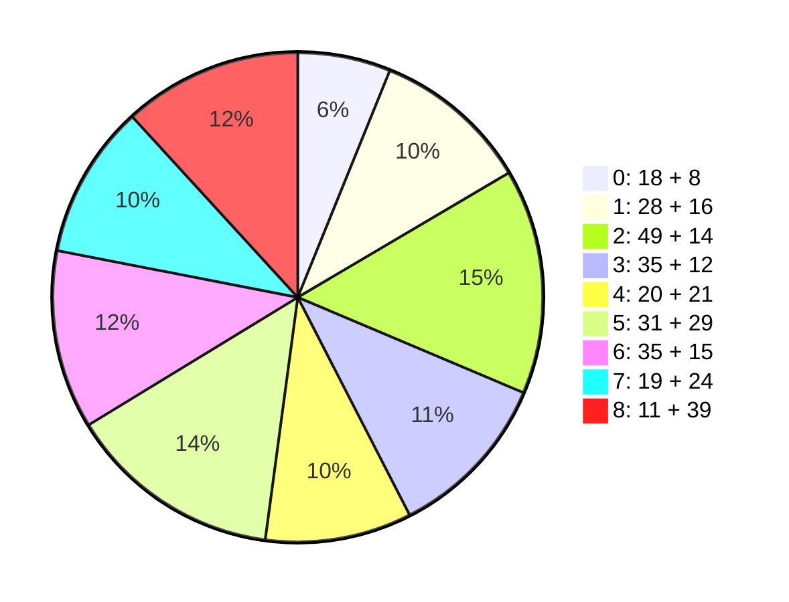

### 量化 ###

### 1.毛泽东思想&&历史地位 ###

!!! note "28 + 16"
	1. 单选
		1. 19世纪中叶，马恩提出 **唯物史观，剩余价值**，创立 **科学社会主义**
		2. 19世纪末20世纪初，世界进入 帝国主义 和 无产阶级革命 时代，**战争与革命**（~~和平与发展，世界大同，相互孤立~~）成为时代主题
		3. **俄国十月革命**开辟了 世界无产阶级社会主义革命 的新时代，给中国送来 **马克思列宁主义**
		4. **遵义会议**挽救了党，红军，中国革命
		5. **党的六届七中全会**确立毛泽东的领导地位（《关于若干历史问题的决议》）
		6. **党的七大**将毛泽东写入党章
		7. 新民主主义革命理论的基本点：3点
		8. 武装斗争 是无产阶级领导的，以 **农民** 为主体的革命战争
		9. 中共在革命中战胜敌人的 3 大法宝：**统一战线**，**武装斗争**，**党的建设**
		10. 建立社会主义制度后，毛泽东探索社会主义道路的思想和方针：3 个
		11. **三湾改编**从组织上确立党对军队的领导
		12. 三湾改编的主要内容：在政治上官兵平等，成立各级士兵委员会，实行民主制度
		13. 毛泽东的对敌策略：区别对待、分化瓦解；争取多数、反对少数、各个击破；有理、有利、有节
		14. 无产阶级及其政党实现对同盟者的领导的必要条件：3个
		15. **毛泽东思想的活的灵魂**的基本方面：**实事求是**，**群众路线**，**独立自主**
		16. 毛泽东在《反对本本主义》中提出“没有调查，没有发言权”
		17. **党的六届六中**，毛泽东以 **“实事求是”** 为题，提倡马克思主义同中国实际相结合
		18. 经过延安整风和党的七大，实事求是的路线在全党得到了确立
		19. 实事求是的内涵：一切从实际出发，理论联系实际，坚持在实践中检验真理和发展真理
		20. 坚持实事求是的正确做法：深入了解事物的本来面貌，把握事物内在必然联系，按照客观规律办事
		21. 坚持实事求是的具体做法：立足于基本国情；纠正因循守旧，故步自封的观念和想法
		22. 群众路线 对应于 马克思主义：“**人民群众**是历史的创造者”
		23. 同(16)
		24. 独立自主的内涵：独立思考，走自己的路；维护民族独立，捍卫国家主权；把立足点放在依靠自己的力量的基础上，同时积极争取外援，开展国际经济文化交流
		25. 符合独立自主的政策：以和平的方式解决国际争端；反对各种形式的霸权主义和强权政治；反对以强凌弱
		26. 正确的做法：以通俗语言解释深刻道理，废止“洋八股”，反对教条主义，表达方式上具有鲜明的民族特色
		27. 对历史人物的正确评价：放在取所处时代和社会历史条件来分析
		28. **党的十一届六中**，《党的若干问题的决议》，对毛泽东思想的评价
	2. 多选
		1. 毛泽东思想的发展时期：新民主主义革命，社会主义革命，社会主义建设
		2. 毛《中国社会各阶段的分析》，《湖南农民运动考察报告》：提出各阶级的作用，农民斗争的重要性，新民主主义革命的基本思想
		3. 土地革命：农村包围城市，武装夺取政权
		4. 毛《中国的红色正确为什么能够存在？》，《井冈山的战争》，《星星之火，可以燎原》，《反对并本本主义》：指明中国革命发展规律，阐述农村包围城市，武装夺取政权的思想；毛泽东思想初步形成
		5. 毛《实践论》，《矛盾论》：运用马克思主义的认识论和辩证法，分析党内“左”的和“右”的错误思想根源
		6. 毛《实践论》，《中国革命和中国共产党》，《新民主主义论》，《论联合政府》：新民主主义革命的对象，动力，领导力量，性质，前途
		7. 《七中二届报告》，《论人民民主专政》，《论十大关系》，《关于正确处理人民内部矛盾的问题》：社会主义革命/建设的思想，毛泽东思想的发展
		8. 农民为主要成分的革命军队 `->` 无产阶级性质，具有严格纪律，同人民群众保持亲密联系 的新型人民军队
		9. 惩前毖后，治病救人：针对“左”的错误
		10. 谦虚，谨慎，不骄，不躁
		11. 辩证唯物主义，历史唯物主义
		12. 毛《实践论》，《矛盾论》：理论对实践的依赖关系，矛盾普遍性和特殊性关系
		13. 发挥人民群众的历史主体作用：调动人民的积极性，主动性，创造性
		14. 毛思想：新民主主义革命，社会主义革命/建设，军队/国防建设，政策和策略，思想/文化/外交工作，党的建设
		15. 毛思想的现实指导作用：4个
		16. 毛的贡献：中国共产党创立 & 发展，中国人民解放军的创立 & 发展，中国各族人民解法事业的胜利，中华人民共和国的缔造 & 社会主义事业的发展

- 毛泽东
	- 6.6(实事求是)，6.7(领导地位)，7.0(写入党章)
	- 活的灵魂：实事求是，群众路线，独立自主
	- 实事求是：15~21
	- 群众路线：22
	- 独立自主：23~25

### 2. 新民主主义革命理论(1919-1945) ###

!!! note "49 + 14"
	1. 单选
		1. 中国不可能发展为资本主义国家的原因：3 个
		2. 半殖民地，半封建的近代中国的主要矛盾：帝国主义和中华民族的矛盾
		3. 资本主义 `->` 社会主义：俄国十月革命
		4. 新民主主义革命开始的标志：五四运动
		5. 推翻君主专制制度，但未改变社会性质(半殖民地半封建)的运动：孙中山 - 辛亥革命
		6. 党形成的适合中国国情的革命理论：新民主主义
		7. 党开展延安整风(1941-1945)，提高马克思主义水平的时期：抗日战争(1931-9.18~1945)
		8. 使全党对中国革命基本问题的认识达到一致的文件：《关于若干历史问题的决议》
		9. 毛泽东提出“新民主主义革命”的文件：《中国革命和中国共产党》
		10. 毛泽东总结“新民主主义革命”总路线的文件：《在普绥干部会议上的讲话》
		11. 新民主主义革命的理解：**无产阶级**领导，**反帝反封建反官僚资本**，人民的革命
		12. 新民主主义革命的“友”：民族资产阶级
		13. 中国革命的首要对象：帝国主义
		14. 中国社会进度的障碍：帝国主义
		15. 地主阶级：剥削压迫农民的阶级，帝国主义统治中国&封建军阀实行专制统治的社会基础，中国经济现代化&政治民主化的主要障碍
		16. 反对封建主义：消灭封建的官僚军阀专制统治(政治)，消灭封建土地所有制(经济)，为中国的经济现代化和政治民主化创造条件
		17. 官僚资本主义：通过国家垄断金融机构，滥伐纸币和国债而疯狂侵吞社会财富；通过家里国家专卖制度控制大量商品和物资而压迫和兼并私人资本主义企业
		18. 社会主要矛盾/革命的主要对象：大革命时期(1924-1927)`->`帝国主义支持下的北洋军阀；土地革命(1927-1937)`->`国民党新军阀；抗日战争(1931-1945)`->`日本帝国主义；解放战争时期(1946-1949)`->`美帝国主义支持下的国民党反动派
		19. 大革命时期的革命对象：见(18)
		20. 土地革命战争时期的革命对象：见(18)
		21. 抗日战争时期的革命对象：见(18)
		22. 解放战争时期的革命对象：见(18)
		23. 中国革命最基本的动力：无产阶级
		24. **无产阶级**的描述：近代中国最进步的阶级，伴随着外国帝国主义在中国直接经营企业而产生，社会生产力的代表，与中国民族工业的产生有关
		25. 中国革命的主力军：农民
		26. 城市小资产阶级：知识分子，小商人，手工业者
		27. 对待民族资产阶级：争取民族资产阶级(政治)，保护民族工商业(经济)，对民族资产阶级又斗争又联合
		28. **无产阶级**的优点：与先进的生产方式想联系，没有私人占有的生产资料，富于组织纪律性
		29. **中国无产阶级**的优点：分布集中，有利于无产阶级队伍组织和团结；大部分出身于破产农民，和农民有着天然的联系；革命斗争中币其他阶级更坚决和彻底
		30. 共产党成为农民和革命民主派的领导者的原因：中国没有代表农民的政党；民族资产阶级的政党没有坚决土地纲领
		31. **新/旧民主主义革命相比**，前者的特点：中国共产党领导，马克思主义作为思想指导，“新革命”是世界无产阶级社会主义的一部分
		32. **新民主主义革命与社会主义革命的不同**：前者联合民族资产阶级一起反对共同敌人(政治)，前者保护民族工商业(经济)，前者属于资产阶级民主主义革命
		33. 毛《新民主主义论》：阐述新民主主义的政治，经济，文化
		34. 毛《论联合政府》：把新民主主义的政治，经济，文化与党的纲领联系起来
		35. 新民主主义**政治纲领**：推翻帝国主义和封建主义的统治；建立无产阶级领导的，工农联盟为基础的，各革命阶段联合专政的新民主主义的共和国；新民主主义共和国不同于欧美式的资产阶级专政的国家
		36. 新民主主义国家的**国体**：无产阶级领导，以工农联盟为基础(小资产阶级，民族资产阶级，反帝反封建的人们在内的各革命阶级)的联合专政
		37. 新民主主义的**经济纲领**：没收官僚资产阶级的垄断资本并且归国家所有，保护民族工商业，没收封建地主阶级的土地，没收封建地主阶级的土地归农民所有
		38. 土地改革的主要任务：满足贫雇农的要求
		39. 土地革命的路线：依靠贫雇农；团结中农；有步骤，有分别地消灭封建剥削制度
		40. 新民主主义**文化**：反对帝国主义，主张中华民族的尊严和独立；尊重中国历史，反对民族虚无主义；具有鲜明的民族风格，民主形式，民族特色
		41. 新民主主义文化是民族的：主张中华民族的尊严和独立；具有鲜明的民族风格，民族形式，民族特色；大量吸收外国的进步文化
		42. 新民主主义文化是科学的：反对一切的封建思想和迷信思想；主张实事求是，客观真理及理论和实践的一致性；以历史唯物主义的态度对待古今中外文化
		43. 新民主主义文化是大众的：普及于大众又提高大众；在革命前是革命的思想准备；在革命过程中是革命总战线中的一条必要和重要的战线
		44. 1927大革命失败，党工作重心转向：农村
		45. 中国革命必须走农村包围城市，武装夺取政权的道路，具体体现在：资本主义国家需要经过长期的，公开的合法斗争，再组织武装起义，夺取政权；中国革命的主要斗争形式只能是武装斗争，以革命的武装消灭反革命的武装，相应的组织形式必然是军队；必须充分地发动农民，否则无法摧毁帝国主义和封建地主阶级反动统治的基础
		46. 毛《<共产党人>发刊词》总结中国革命两次胜利和两次失败的经验教训，提出统一战线，武装斗争，党的建设是党在中国革命中战胜敌人的三大法宝(1939-10)
		47. 统一战线的说法：建立巩固的工农联盟；在联合民族资产阶级的过程中，在思想/政治/组织上进行必要的斗争；保持党在政治/组织/思想上的独立性
		48. 民主集中制的原则：个人服从组织，下级服从上级，全党服从中央
		49. 毛《论人民民主专政》：概括新民主主义革命的基本经验，丰富/发展马克思主义关于无产阶级领导人民革命的理论
	2. 多选
		1. 帝国主义使中国半殖民地半封建化的表现：破坏领土完整，勒索巨额“战争赔款”，享有领事裁判权，控制海关
		2. 中国占支配地位的主要矛盾：帝国主义和中华民族的矛盾，封建主义和人民群众的矛盾
		3. 不能完成反帝反封建的革命任务：4 个
		4. 党幼年时期推动国民党改组和国民革命军建立领导反帝反封建的运动（大革命高潮）：工人运动，青年运动，农民运动，妇女运动
		5. 无产阶级诞生于半殖民地半封建社会，主要组成是：铁路，矿山，海运，纺织，造船等产业的工人
		6. 反对官僚资本主义的原因：其与外国资本主义，本国地主阶级，旧式富农密切地结合；其与大地主资产阶级的反革命国家政权密切结合，成为国民党统治的经济基础；它是买办的封建的国家垄断资本主义；它对中国经济发展和社会进步起着严重的阻碍作用
		7. 毛“工农武装割据”思想，农村包围城市革命道路理论：《中国的红色政权为什么能够存在？》，《井冈山的斗争》，《星星之火可以燎原》
		8. 农民，城市小资产阶级，其他中间阶级 团结形成统一战线
		9. 新民主主义革命时期的统一战线：第一次国共合作的统一战线，工农民主统一战线，抗日民族统一战线，人民民主统一战线
		10. 党在新民主主义革命时期建设人民军队的经验：坚持党对军队的绝对领导，建设全心全意为人民服务的人民军队，开展革命的政治工作；坚持正确的战略战术原则
		11. 人民军队政治工作的基本原则：官兵一致，军民一致，瓦解敌军，优待俘虏
		12. 党加强自身建设的经验：**思想建设**始终放在党的建设的首位；始终重视**组织建设**；重视**作风建设**；联系党的政治路线加强党的建设
		13. 大革命失败后，党内“左”倾教条主义着的错误：主张“城市中心论”；对统一战线的重要性缺乏认识；把中间势力当作最危险的敌人；把 反对资本主义 和 反帝反封建 相提并论；
		14. 党的优良作风：理论联系实际，密切联系群众，批评与自我批评相结合

!!! 补充
	- 两次胜利，两次失败：1927基本推翻北洋军阀，1936红军长征胜利；1927国民党右派叛变革命，大革命失败；1934红军第五次反“围剿”失败，被迫进行长征

### 3. 社会主义改造理论 ###

记 $S_1$ 为新民主主义(1919-1945)，$S_{11}$ 为大革命(1924-1927)，$S_{12}$ 为土地革命(1927-1937)，$S_{13}$ 为抗日战争(1931-1945)

记 $S_2$ 为社会主义

!!! note "35 + 12"
	1. 单选
		1. 新民主主义 `->` 社会主义 的过渡期：新中国成立 `->` 社会主义改造基本完成
		2. 新民主主义社会中的经济成分：社会主义性质的**国营经济**，农民和手工业者的**个体经济**，**私人资本主义经济**
		3. 新民主主义社会扩大**国营经济**，将**个体经济**和**资本主义经济**改变为**社会主义经济**
		4. $S_1$ 时期的阶级：工人/农民/民族资产阶级
		5. $S_{12}$ 基本完成后的主要矛盾：工人阶级和资产阶级的矛盾
		6. 党的 7.2 的**两个转变**：由农业国转变为工业国，由新民主主义国家转变为社会主义国家
		7. 1949-1952 **恢复经济**，继续完成**民主革命遗留任务**的成就：完成土地改革，镇压反革命运动，开展 “三反” “无反” 运动
		8. 1952：国民经济恢复，民主革命遗留任务已经完成，政治/经济/社会面貌发生巨大变化
		9. 党在过渡时期的总路线 “一化三改”：“三改”指的是对 个体农业/手工业/工商业 的社会主义改造
		10. 对党在过渡时期的总路线的认识：体现社会主义工业化和社会主义改造的紧密结合，生产力与发展生产力的有机统一，生产关系与发展生产力的有机统一
		11. 马恩《共产党宣言》：工人革命第一步是使无产阶级上升为统治阶级
		12. 新民主主义时期的国际形势：苏联社会主义比资本主义更具优越性，资本主义国家不景气，朝鲜战争停战
		13. 农业社会主义改造道路的描述：不能采取剥夺(引导/说服/教育)；依靠贫下中农/消灭富农剥削；高级农业生产合作社的生产资料归集体所有，取消土地报酬，实行按劳分配
		14. 农业/手工业社会主义改造的自愿互利原则：说服教育/典型示范/国家帮助；农民/手工业者加入合作社时，合理处理生产资料入社的折价/收益补偿问题；农民/手工业者入社后，处理好各方面的经济关系/收益分配问题
		15. 互助组：解决农业生产过程中劳动力/畜力/农具不足的困难，由农民自愿组成，具有社会主义萌芽性质
		16. **初级农业生产合作社**：以土地入股，耕畜/农具作价入社，由社实行统一经营；劳动产品按劳分配 + 土地入股分红；具有**半社会主义性质**
		17. **高级农业生产合作社**：取消土地报酬；**社会主义性质**的集体经济组织；按劳分配
		18. **个体手工业经济**：以**生产资料私有制**和**个体劳动**为基础；规模狭小；经营分散
		19. 手工业供销小组：由独立手工业者/家庭手工业者通过由国营商业或供销合作社供给原料和报销产品，推销成品通过**加工订货**方式组织起来；摆脱了工业资本/商业资本/高利贷的剥削和控制；具有**社会主义萌芽性质**
		20. 手工业**供销**合作社：由供销合作社 供应原料/推销产品/加工订货；具有**半社会主义性质**；生产活动由社员扥收纳独立完成
		21. 手工业**生产**合作社：在国家计划指导下，根据市场需要灵活安排，采取集中生产/分散生产/流动服务等经营方式；生产资料归社员集体所有；采取个人/小组 计件/计时工资 加 奖励/分成工资等形式
		22. 对**资本主义工商业**进行社会主义改造：将工人阶级和民族资产阶级的对抗性矛盾转化为非对抗性矛盾，按照人民内部矛盾来处理；采取从低级到高级的国家资本主义的过渡形式；把资本主义工商业者改造成为自食其力的社会主义劳动者
		23. 对资本主义工商业实行**和平赎买**：有利于发挥私营工商业在国计民生方面的积极作用；有利于争取和团结民族资产阶级；有利于发挥民族资产阶级中大多数人的知识/才能/技术专长/管理经验
		24. 外国能对对资本主义工商业实行**和平赎买**的原因：民族资产阶级既有剥削工人取得理论的一面，又有拥护党的领导，用户宪法，愿意接受社会主义改造的一面；党和民族资产阶级长期保持统一战线；外国建立了强大的社会主义国营经济，掌握看国家经济命脉
		25. **国家资本主义经济**：由人民政府管理；用各种形式和国营社会主义经济联系着；受工人监督
		26. 国家资本主义的高级形式：统购包销，委托加工，计划订货
		27. 对**资本主义工商业**进行社会主义改造(资本主义工商业者 `->` 社会主义劳动者)的意义：对企业的改造和对人的改造相结合；改造资本家个人和消灭他们所属的资产阶级相结合；避免阶级对抗，减少了改造的阻力
		28. 社会主义改造的历史经验：坚持社会主义建设与社会主义改造同时并举；积极引导，初步过渡；和平方法进行改造
		29. 1956 社会主义改造基本完成，**“一五”计划**提前完成；11957 各项指标均超额完成
		30. “一五”的大规模建设，以**重工业**为中点的社会主义工业化基础已初步建立
		31. 社会主义改造和**社会主义工业化**同时并举的意义：保持社会稳定，改善人民生活，推动社会进步
		32. 1956年底，对 农业/手工业/资本主义工商业 的社会主义改造基本完成；农业，手工业个体所有制转变为劳动群众集体所有的公有制
		33. 1954-9 第一届全国人民代表大会，《中华人民共和国宪法》
		34. 社会主义基本制度 `->` 社会主义经济制度 和 社会经济结构 变化 `->` 阶级关系变化：帝国主义侵略势力已经被清除出中国大陆；官僚资产阶级已经在中国国内被消灭；广大劳动人民从此摆脱了被剥削被奴役的地位
		35. 社会主义基本制度证明了马克思主义的真理性？丰富和发展了科学社会主义
	2. 多选

### 4. 社会主义建设道路初步探索的理论成果 ###

!!! note "20 + 21"
	1. 单选
		1. 

### 5. 中国特色社会主义理论体系的形成发展 ###

!!! note "31 + 29"

### 6. 邓小平理论 ###

!!! note "35 + 15"

### 7. 三个代表重要思想 ###

!!! note "19 + 24"

### 8. 科学发展观 ###

!!! note "11 + 39"

