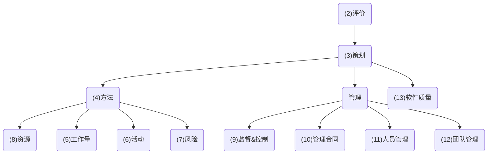

软件项目管理中的 关键字关系 的臆测：




####  ####

### 1.软件项目管理引言 ###

1. 引言
2. 软件项目管理的**重要性**
3. 项目
4. 软件项目 vs 其他项目
5. 合同管理 & 技术项目管理
6. 软件项目管理的活动
7. 计划、方法、方法学
8. 软件项目的**分类**方式
9. 利益相关者
10. 设定目标 - 子目标，目标
11. 业务案例
12. 项目成败
13. 管理
14. 管理控制
15. 小节
16. 进一步练习

```
软管 - 重要性，合同？活动，计划/方法/方法学，分类，利益相关者，设定目标。。。

（自身属性）


软管 -> 其他管理

（同类衬托）
```

### 2.项目评价，项目集管理 ###

是首尾呼应还是贯穿始终？

1. 引言
2. 业务案例：介绍与背景，提议项目，市场，组织和运营基础架构，效益，概括实施计划，成本，经济论证，风险
3. 项目组合管理：项目组合 定义，管理，优化，管理的问题
4. 单个项目评估：技术评估，成本效益分析，现金流预测
5. 成本效益评价技术：净利润，回收期，投资回报率，净现值，内部回报率
6. 风险评价：风险标识和排等级，风险和净现值，成本效益分析，风险剖面分析，使用决策树
7. 项目集管理：商业周期项目集，战略项目集，基础设施项目集，研究和开发项目集，创新的伙伴关系
8. 管理项目集内的资源分配
9. 项目集管理策略
10. 创建项目集：项目集命令，项目集摘要，构想陈述，蓝图
11. 辅助项目集管理：依赖关系图，交付计划
12. 对项目集管理的保留意见
13. 收益管理

### 3.项目策划概述 ###

1. 步进式项目策划概述
2. 0，选择项目
3. 1，标识项目的 范围和目标：标识目标以及满足目标有效性的实用度量，确立项目的主权管理者，利益相关者分析，根据对利益相关者的分析修改项目目标，确定各部门的沟通
4. 2，标识项目的 基础设施：项目和战略策划之间的关系，安装标准和规程，项目组的组织结构
5. 3，分析项目的 特征：目标驱动？ or 产品驱动？，其他特征，高级别风险，关于实现方面的用户需求，开发方法学&生命周期方法，评审整体资源估计
6. 4，标识项目的 产品和活动：产品（可交付之物），文档化共性产品流，产品实例，活动网络图，活动网络
7. 5，估算每个活动的工作量：自底向上的估计，修改策划创建可控制的活动
8. 6，标识活动风险：标识和量化基于活动的风险，风险缓解和应急措施，风险调整激活和估计
9. 7，分配资源：标识和分配 资源，根据资源约束修改计划和估计
10. 8，评审/发布计划：评审项目计划的质量，文档化计划并取得一致意见
11. 9/10，执行计划并进行较低层次的策划

### 4.选择合适的项目方法 ###

1. 引言
2. 构建 or 购买
3. 选择方法学和技术：目标驱动 or 产品驱动，分析其他项目特征，标识高级别项目风险，考虑与实现有关的用户需求，选择通用的生命周期方法
4. 过程模型的选择
5. 结构与交付速度
6. 瀑布模型
7. 螺旋模型
8. 软件原型开发
9. 分类原型的其他方法：要从原型中学到什么，原型要做到什么程度，哪些需要进行原型化，在原型开发期间控制变更
10. 增量式交付：优点，缺点，增量式交付计划，系统目标，开放的技术目标，增量式计划，增量示例
11. 敏捷方法
12. Atern/动态系统开发方式
13. 极限编程：策略活动，小规模发布软件，隐喻，简单设计，测试，重构，结对编程，集体所有，持续集成，每周40小时的工作时间，香肠客户，编程标准，XP 的局限性
14. 管理迭代过程
15. 选择最合适的过程模型

### 5.软件工作量估计 ###

1. 引言
2. 在何时进行估计
3. 估计过高 & 估计过低
4. 软件估计基础：需要历史数据，工作的度量
5. 软件工作量估计技术
6. 自底向上估计
7. 自顶向下法和参数模型
8. 专家判断
9. 类比估计
10. Albrecht 功能点分析
11. Mark II 功能点
12. COSMIC 全功能点
13. COCOMO II：参数化的生产率模型


