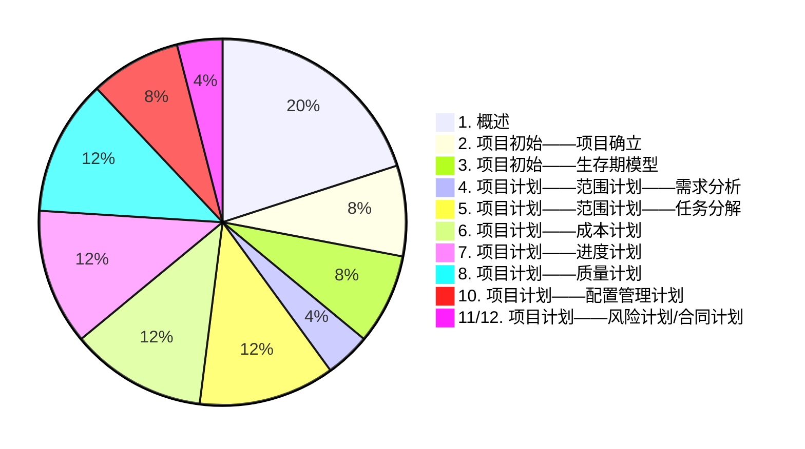

###  ###


```title="题目组成"
选择题 35 * 1
判断题 15 * 1
简答题 6 * 5
计算题 2 * 10
```



### 重点 ###

11. wbs
	- 定义：将项目分解为更多的工作细目或子项目，使得项目变得更小，更易管理，更易操作
	- 意义：使项目的任务结构变得清晰，工作目标更加明确
18. 网络图，甘特图：
	1. 甘特图：用于显示任务的工期，开始时间，结束时间，资源的基本信息的条形图；以 wbs的任务-项目时间 为轴；棒状，三角形
	2. 网络图：是活动排序的一个输出(拓扑图)，用于展示项目中的各个活动以及活动之间的逻辑关系，表明项目任务将如何进行以及以什么顺序进行；PDM，ADM，CDM
24. 组织形式
	1. 职能型：标准的金字塔形的线性组织结构;项目以部门为主体承担多个项目，一个项目有多个部门，一个部门有部门经理和项目经理这两个负责人（资源共享，人员灵活性高；客户利益与职能部门利益经常冲突，多重领导，资源平衡问题）
	2. 任务型：部门完全按照项目进行设置的单目标垂直组织方式；一个项目对应一个类似部门的项目组（临时的），项目完成后，这个项目组代表的部门就解散了（以项目为中心，决策速度快，无多重领导；资源不共享，项目成员缺乏安全感）
	3. 矩阵型：职能型和项目型的混合体；根据项目的需要，从不同的部门中选择合适的项目人员组成一个临时项目组，项目结束后，这个项目组就解体了，然后各个成员回到各自原来的部门，团队的成员需要想不通的经理汇报工作（以项目为中心，能迅速解决问题；多重领导，权利冲突，会有焦虑与压力）
	4. 注：决策速度，多重领导/权利冲突，资源共享
20. 合同
	1. 总价合同：固定总价FFP(乙方风险大)，总价加激励费用FPIF(乙方风险大)，总价加经济价格调整FPEPA
	2. 成本补偿：成本加固定费用CPFF(甲方风险大)，成本加激励费用(乙方风险增加)，成本加奖励费用


### 复习(重排问题) ###

待补：质量问题

记 “疑” 为 “疑似简答题”

记 “候” 为 “候选简答题”

1. 项目的定义，概念  (1，疑)
	- 为了创造一个唯一的产品或提供一个唯一的服务而进行的**临时性**的努力
	- 以一套独特而相互联系的任务为前提，有效地利用资源，在一定时间内满足一系列特定目标的多项相关工作的总称
	- 特征：目标性，相关性，临时性，独特性，资源约束性，不确定性
2. 项目管理三维约束 (?)：范围，时间，成本  
3. PMI 的定义  (1)
	- 美国项目管理协会
4. PMI 推行了什么项目  (1)
	- 项目管理专业人员资格 PMP（project management professional）是**美国项目管理学会**
	（project management institute，PMI）开发并负责组织实施的一种专业资格认证
	- PMBOK（项目管理知识体系）？
23. 项目管理的知识领域，过程组  (1，疑)
	- 知识领域：集成，范围，进度，成本，质量，资源，沟通，风险，采购，干系人（软件 xxx 管理）
	- 过程组：启动，计划，执行，控制，收尾（xxx 过程组）
6. 项目章程的定义 (2)
	- 项目章程是一份正式批准项目，并且授权项目经理在活动中使用组织资源的文件
21. 招标方式 (2)
	- 公开招标，有限招标，多方洽谈，直接谈判
5. {==生存期模型分类，特点==}（微型？Scrum？）  (3，候)
	- 预测型：瀑布模型（上一阶段的输出作为下一阶段的输入），V模型（甲方需求明确，乙方解决方案也很明确，对安全性也严格）
	- 适应型：迭代型（(快速)原型模型：项目需求在项目初始阶段不确定，需要减少不确定性时使用），增量型（渐进式阶段模型），敏捷型（Scrum，XP，OpenUp，看板方法，Scrumban方法，精益模型(lean)，持续交付，DevOps）
	- 混合型：先敏捷后预测综合方法；敏捷和预测综合方法；以预测法为主，敏捷方法为辅的方法；以敏捷方法为主，预测法为辅的方法
24. {==项目初始阶段的任务==} (2,3)
	1. 项目确立
		1. 评估：(分析)项目启动背景，可行性分析（从 战略，操作性，计划，技术，社会可行性，市场可行性，经济可行性 等方面进行评估），成本效益分析（现金流预测，净利润 NP，投资回报期 PP，投资回报率 ROI，净现值 NPV，内部回报率 IRR）
		2. 立项：识别发起者，论证项目，申请项目，申请审核，确定项目立项；`make or buy`自造-购买决策
		3. 招投标：甲方进行 招标书定义，供方选择，合同签署；乙方进行 项目选择（项目分析，竞标，合同签署）
			- 招标方式：公开招标，有限招标，多方洽谈，直接谈判
		4. 项目章程：
	2. 生存期模型
7. 需求分析的内容 (4)：
	- (定义)为最终用户所看到的系统建立一个概念模型，是对需求的抽象描述，并尽可能多地捕获现实世界的含义
	- 活动：以图表的方式描述系统的整体结构（包括系统的边界和接口）；通过原型，页面流或其他方式想用户提供可视化界面，用户可以对需求做出自己的评价；以模型描述系统的功能项，数据视图，外部实体，实体之间的关系，实体之间的状态转换等方面的内容
8. wbs 工作分解的定义，意义 (5)
	- wb 的定义：任务分解的结果包含所有要做的工作，而且这些工作必须完成；提供项目范围基线
	- wbs 的定义：将项目分解为更多的工作细目或子项目，使得项目变得更小，更易管理，更易操作
9. **范围变更的定义** (5)？？
	- 在项目执行过程中，对项目的目标、交付成果或其它相关要素进行更改的过程。范围变更可能涉及增加、修改或删除项目的某些方面，需要经过变更控制程序的评估和批准。
10. **范围基线的定义** (5)？？
	- 在项目规划阶段确定的项目范围，进度，成本三个方面的基准。它用于作为衡量项目执行过程中**范围变更**的依据，以确保变更的控制和管理。
14. 成本估算的方法，特点，举例 (6)
	- 方法：代码行(LOC)，功能点(FP)，用例点，类比，自上而下，三点，COCOMO，COCOMO 81，COCOMO II，
		Walston-Felix，基于神经网络估算，专家，猜测
	- 特点：
	- 举例：
15. {==估算文件==} (6)
	- 包括项目需要的资源，资源的数量，质量标准，估算成本等信息，单位一般以货币作为单位（也可以是规模单位，然后转换为货币单位）
	- 估算说明应该包括工作范围的描述（一般由 WBS 获得），估算的基础和依据
22. **COCOMO81 模型** (6)
	- $\text{Effort} = a \cdot \text{KLOC}^b \cdot F$，$F=\prod\limits_{i=1}^{15} D_i$
11. {==压缩工期带来的影响==} (7 | 13 | 14)？？
	- 压缩工期意味着缩短项目的时间表，通常通过增加资源或调整任务依赖关系来实现。然而，压缩工期可能会增加项目的成本和风险，可能导致质量下降和资源过度利用等问题。
13. {==网络图 (7)，甘特图 (4 | 7 | 10)==}
	- 甘特图：能显示任务的工期，开始时间，结束时间，资源的基本信息的条形图；将 WBS 的任务排列在垂直轴，而水平轴表示时间
	- 网络图：是活动排序的一个输出，用于展示项目中的各个活动及活动之间的逻辑关系，表明项目任务将如何进行以及以什么顺序进行
25. {==软件项目管理任务之间的几种关系==} (7)
	- 结束 $\to$ 开始（Finish to Start，FS）：A 任务在 B 任务开始前结束
	- 开始 $\to$ 开始（Start to Start，SS）：A 任务开始，B 任务也可以开始，它们具有相同的前置任务
	- 结束 $\to$ 结束（Finish to Finish，FF）：A 任务结束，B 任务也可以结束，它们具有相同的后置任务
	- 开始 $\to$ 结束（Start to Finish，SF）：A 任务开始时，B 任务应该结束
12. {==质量管理==} (8)？？
	- log(记录，日志)，lead(提前)， delay(延期)
	- 在软件项目管理中，质量管理通过记录（log）项目中的各种数据和信息，包括进展、问题、风险等，以便进行监控和改进。Lead time（提前时间）是指任务或活动提前开始的时间，可以用来加快项目进度。Delay（延期）则指任务或活动延迟完成的情况，可能会导致项目进度延误。质量管理通过日志记录和分析延期情况，可以帮助项目团队及时发现和解决延期问题，确保项目按时交付和达到预期的质量要求。
	- 
16. {==质量成本==} (8)
	- 由于产品的第一次工作不正常而衍生的附加花费
	- 分类：预防成本（评估费用，预防费用），缺陷成本（内部费用，外部费用）
17. {==质量控制==} (8)
	- 质量控制是指通过一系列的控制活动和方法，确保项目的产品和交付物符合质量要求。质量控制包括制定质量标准、执行质量检查、解决质量问题等步骤，旨在提高项目的质量水平和客户满意度。
	- 确定项目结果与质量标准是否相符，同时确定不符的原因和消除方法，控制产品的质量，及时纠正缺陷的过程
18. {==组织形式 && 优缺点==} (10)
	- 职能型
	- 项目型
	- 矩阵型
19. {==责任分配矩阵==}  (10)
	- 责任分配矩阵是一种表格，用于将项目工作与相关的人员或团队进行关联和分配。它明确了每个人员或团队在项目中承担的责任和角色。
	- 责任分配矩阵（responsibility assignment matrix，RAM）：使用关系矩阵来对项目团队进行项目团队成员进行分工，使员工明确其角色和职责；以 活动-项目人员/团队 为坐标轴，每个矩阵元素为某个动作（如：approver批准，reviews评审，participant参加，creator建立）
20. {==合同类型，风险==} (11,12)
	- 总价合同：固定总价（FFP）合同，总价加激励费用（Fixed Price Plus Incentive Fee，FPIIF）合同，总价加经济价格调整（FPEPA）合同
	- 成本补偿合同：成本加固定费用（Cost Plus Fixed Fee，CPFF）合同，成本价奖金（Cost Plus Incentive Fee，CPIF），成本加奖励费用（CPAF）合同
	- 工料合同
18. 组织形式


!!! 大题
	1. COCOMO 81
		- $\text{Effort} = a \cdot \text{KLOC}^b \cdot F，F=\prod\limits_{i=1}^{15} D_i$
		- $D_i$ 为第 i 个成本驱动因子的取值
		- a,b取决于项目模式（有机型/嵌入型/半嵌入型）
		- $a, b,D_i$ 均可通过查表获得
	2. make or buy
		1. 自造方案：制造费，维护费
		2. 购买方案：购买费，维护费
		3. 制造差额，服务差额
		4. 资质方案承受月份 = 制造差额 / 服务差额

### 题目优化 ###

!!! 题目优化
	1. 概述
	2. 初始——项目确立
	3. 初始——生存期模型
	4. 计划——范围——需求管理
		- 需求管理过程：需求获取，需求分析，需求规格编写，需求验证，需求变更
		- 需求分析方法(传统)
			1. 原型分析
			2. 基于数据流（结构化分析 `SA`）：数据流图 `DFD`(实体, 过程, 数据存储, 数据流)，数据字典 `DD`(数据项, 数据文件, 数据流)，实体联系图 `ERD`，系统分析图
			3. UML（面向对象分析）：用例图，静态结构图（类/对象/组件/部署 图），行为图（活动/状态机/序列 图）
			4. 功能列表 `FL`：
		- 需求分析方法(敏捷)：用户故事
	5. 计划——范围——任务分解
		- 概念：
			- 任务分解 `wbs`：将一个项目分解为更多的工作细目或子项目，使项目变得更小，更易管理，更易操作；（提供了项目范围基线）
			- 工作包 `wp`：wbs 最低层次的可交付成果，是 wbs 的最小元素；由唯一主体负责；可以交给另一个项目经理完成？
			- 工作细目：具有唯一**编码**
		- 任务分解形式：提纲式，组织结构式
		- 任务分解的方法(4 种)：模板参照方法，类比方法（），自顶向下方法（适用于**对项目比较熟系或对项目大局有把握**的情况），自底向上方法（适用于**不熟悉项目**的情况）
		- 范围基线：在项目规划阶段确定的项目范围，进度，成本三个方面的基准。为衡量项目执行过程中的**范围变更**提供依据，以确fd保变更的控制和管理
	6. 计划——成本
		- 成本分类：直接成本（人力），间接成本
		- 成本估算方法(传统，12 种)：代码行(LOC)，功能点(FP；5类组件的计数项；与技术/语言无关)，类比，自上而下，用例点，三点；COCOMO 81，COCOMO II，Walston-Felix，神经网络；专家，猜测
			- 功能点方法的计数项：外部输入，外部输出，外部查询，内部逻辑文件，外部接口文件
			- 分类的方面：历史数据，经验，数学模型
			- 估算的基础：规模
			- 规模单位：LOC，FP，人天/月/年
		- 成本估算方法(敏捷)：故事点（Fibonacci，2的次幂）
		- COCOMO 81：建模等级(基本，中等，高等)，项目模式(有机型，嵌入型，半嵌入型)
	7. 计划——进度
		1. 进度管理图示(6种)：甘特图 `Gantt`（棒状，三角形），网络图（PDM，ADM，CDM）；里程碑图，资源图；燃尽图，燃起图
		2. 任务资源估计
		3. 任务历时估计(9种)：定额估计算法，经验导出模型，**工程评估评审技术PERT**，专家判断，类比估计，基于承诺的进度估计，Jones的一阶估计准则，预留分析，敏捷历时估计
		4. 进度计划编排：超前与滞后设置，关键路径法，时间压缩（应急法/赶工，平行时间法/快速跟进），资源优化，敏捷项目进度编排
	8. 计划——质量
		- 成本：预防成本（评估费用，预防费用），缺陷成本（内部费用，外部费用）
		- 质量模型：Boehm，McCall，ISO/IEC 25010
		- 质量管理：质量保证（项目执行过程审计，项目产品审计），质量控制，质量计划
		- 质量管理活动：质量保证QA，质量控制QC
		- 敏捷项目的质量活动：结对编程，测试驱动开发，持续集成与测试，不同层面自动化测试，严守测试驱动开发，迭代评审，迭代回顾会议，重构
	9. 计划——配置管理
	10. 计划——沟通
		- 项目组织结构：职能型，项目型，矩阵型	
		- 人员职责计划：责任分配矩阵（responsibility assignment matrix，RAM），组织结构图
		- 责任分配矩阵：使用关系矩阵来对项目团队进行项目团队成员进行分工，使员工明确其角色和职责；以 活动-项目人员/团队 为坐标轴，每个矩阵元素为某个动作（如：approver批准，reviews评审，participant参加，creator建立）


### 原序问题  ###


```
1. 项目的定义，概念  (1)
	- 为了创造一个唯一的产品或提供一个唯一的服务而进行的**临时性**的努力
	- 以一套独特而相互联系的任务为前提，有效地利用资源，在一定时间内满足一些列特定目标的多项相关工作的总称
	- 特征：目标性，相关性，临时性，独特性，资源约束性，不确定性
2. 项目管理三维约束 (?)：范围，时间，成本  
3. PMI（工程项目管理组织） 的定义  (1)
	- 美国项目管理协会
4. PMI 推行了什么项目  (1)
	- 项目管理专业人员资格 PMP（project management professional）是**美国项目管理学会**
	（project management institute，PMI）开发并负责组织实施的一种专业资格认证
	- PBMOK（项目管理知识体现 ）？
5. **生存期模型分类，特点**  (3)
	- 分类：预测型，适应型（迭代型，增量型，敏捷型），混合型
	- 特点：
6. 项目章程的定义 (2)：项目章程是一份正式批准项目，并且授权项目经理在活动中使用组织资源的文件
7. 需求分析的内容 (4)：
	- (定义)为最终用户所看到的系统建立一个概念模型，是对需求的抽象描述，并尽可能多地捕获现实世界的含义
	- 活动：以图表的方式描述系统的整体结构（包括系统的边界和接口）；通过原型，页面流或其他方式想用户提供可视化界面，用户可以对需求做出自己的评价；以模型描述系统的功能项，数据视图，外部实体，实体之间的关系，实体之间的状态转换等方面的内容
8. **wbs 工作分解的定义，意义** (5)
	- wb 的定义：任务分解的结果包含所有要做的工作，而且这些工作必须完成；提供项目范围基线
	- wbs 的定义：将项目分解为更多的工作细目或子项目，使得项目变得更小，更易管理，更易操作
9. **范围变更的定义** (5)
	- 在项目执行过程中，对项目的目标、交付成果或其它相关要素进行更改的过程。范围变更可能涉及增加、修改或删除项目的某些方面，需要经过变更控制程序的评估和批准。
10. **范围基线的定义** (5)
	- 范围基线是指在项目规划阶段确定的项目范围、进度和成本三个方面的基准。它用于作为衡量项目执行过程中范围变更的依据，以确保变更的控制和管理。
11. 压缩工期带来的影响 (7 | 13 | 14)
	1. lead(提前)， delay(延期)
12. 质量管理 (8)
	- log(记录，日志)，
13. 网络图 (7)，甘特图 (4 | 7 | 10)
14. 成本估算的方法，特点，举例 (6)
	- 方法：代码行(line of code，LOC)，功能点(Function Point，FP)，用例点，类比，自上而下，三点，参考模型/算法模型/经验导出模型（如：COCOMO 81，COCOMO II，Walston-Felix，神经网络），专家，猜测
	- 特点：
	- 举例：
15. 估算文件 (6)
16. 质量成本 (8)
17. 质量控制 (8)
18. 组织形式 && 优缺点 (10)
19. 责任分配矩阵  (10)
20. 合同类型，风险 (11,12)
21. 招标方式 (2)
22. **COCOMO81 模型** (6)
23. 项目管理的知识领域，过程组  (1)
	- 知识领域：集成，范围，进度，成本，质量，资源，沟通，风险，采购，干系人（软件 xxx 管理）
	- 过程组：启动，计划，执行，控制，收尾（xxx 过程组）
24. 项目初始阶段的任务 (2,3)：项目确立（评估，立项，招投标，项目章程……），生存期模型
25. 软件项目管理任务之间的几种关系 (?)

计算题：项目规模?
	1. make or buy
	2. COCOMO 81

```


